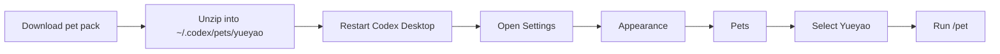

# Codex Pets

> A growing collection of custom pets for Codex Desktop.

[](LICENSE)
[](#pets)

[中文说明](README_CN.md)

## Pets

This gallery is generated from `pets/*/pet.json` and the first frame of each `spritesheet.webp` by `scripts/generate_pet_gallery.py`. Add a new pet folder, rerun the script, and the mosaic expands automatically.


| Pet | Description | Package |
| --- | --- | --- |
| Auruowl | An aurora owl scholar with bright brow feathers for focused review sessions. | [auruowl.codex-pet.zip](packages/auruowl.codex-pet.zip) |
| Bonsaigo | A calm bonsai stone golem companion with a sprout crown. | [bonsaigo.codex-pet.zip](packages/bonsaigo.codex-pet.zip) |
| Canglan | A gentle azure cloud qilin calf with a jade horn and soft cloud mane. | [canglan.codex-pet.zip](packages/canglan.codex-pet.zip) |
| Chadango | A tea lantern tanuki companion with a dango tail charm. | [chadango.codex-pet.zip](packages/chadango.codex-pet.zip) |
| Clockshiba | A clockwork shiba pup with a copper gear collar. | [clockshiba.codex-pet.zip](packages/clockshiba.codex-pet.zip) |
| CorgiByte | A cheerful short-legged corgi coding buddy with a tiny cyan spark charm. | [corgibyte.codex-pet.zip](packages/corgibyte.codex-pet.zip) |
| Glassbun | A glass bunny-dragon hybrid companion with tiny horn ears. | [glassbun.codex-pet.zip](packages/glassbun.codex-pet.zip) |
| Milkbyte | A warm yellow baby dragon with a cream belly and tiny cyan code-spark accents. | [milkbyte.codex-pet.zip](packages/milkbyte.codex-pet.zip) |
| Plaidpup | A black shiba pup in a blue plaid shirt with coherent playful poses. | [plaidpup.codex-pet.zip](packages/plaidpup.codex-pet.zip) |
| Solara | A tiny solar phoenix chick with an ember crest. | [solara.codex-pet.zip](packages/solara.codex-pet.zip) |
| Vowlet | A quiet blond chain guardian with a focused, watchful presence. | [vowlet.codex-pet.zip](packages/vowlet.codex-pet.zip) |
| Yueyao | A rare moonlit glass dragon companion for quiet deep work. | [yueyao.codex-pet.zip](packages/yueyao.codex-pet.zip) |

Detailed animation contact sheets live under `assets/<pet-id>/`.

## Quick Install

Install Auruowl from the repository package:

```bash
curl -L "https://raw.githubusercontent.com/mileson/codex-pets/main/packages/auruowl.codex-pet.zip" -o "/tmp/auruowl.codex-pet.zip" \
  && mkdir -p "$HOME/.codex/pets/auruowl" \
  && unzip -o "/tmp/auruowl.codex-pet.zip" -d "$HOME/.codex/pets/auruowl"
```

Install Bonsaigo from the repository package:

```bash
curl -L "https://raw.githubusercontent.com/mileson/codex-pets/main/packages/bonsaigo.codex-pet.zip" -o "/tmp/bonsaigo.codex-pet.zip" \
  && mkdir -p "$HOME/.codex/pets/bonsaigo" \
  && unzip -o "/tmp/bonsaigo.codex-pet.zip" -d "$HOME/.codex/pets/bonsaigo"
```

Install Canglan from the repository package:

```bash
curl -L "https://raw.githubusercontent.com/mileson/codex-pets/main/packages/canglan.codex-pet.zip" -o "/tmp/canglan.codex-pet.zip" \
  && mkdir -p "$HOME/.codex/pets/canglan" \
  && unzip -o "/tmp/canglan.codex-pet.zip" -d "$HOME/.codex/pets/canglan"
```

Install Chadango from the repository package:

```bash
curl -L "https://raw.githubusercontent.com/mileson/codex-pets/main/packages/chadango.codex-pet.zip" -o "/tmp/chadango.codex-pet.zip" \
  && mkdir -p "$HOME/.codex/pets/chadango" \
  && unzip -o "/tmp/chadango.codex-pet.zip" -d "$HOME/.codex/pets/chadango"
```

Install Clockshiba from the repository package:

```bash
curl -L "https://raw.githubusercontent.com/mileson/codex-pets/main/packages/clockshiba.codex-pet.zip" -o "/tmp/clockshiba.codex-pet.zip" \
  && mkdir -p "$HOME/.codex/pets/clockshiba" \
  && unzip -o "/tmp/clockshiba.codex-pet.zip" -d "$HOME/.codex/pets/clockshiba"
```

Install CorgiByte from the repository package:

```bash
curl -L "https://raw.githubusercontent.com/mileson/codex-pets/main/packages/corgibyte.codex-pet.zip" -o "/tmp/corgibyte.codex-pet.zip" \
  && mkdir -p "$HOME/.codex/pets/corgibyte" \
  && unzip -o "/tmp/corgibyte.codex-pet.zip" -d "$HOME/.codex/pets/corgibyte"
```

Install Glassbun from the repository package:

```bash
curl -L "https://raw.githubusercontent.com/mileson/codex-pets/main/packages/glassbun.codex-pet.zip" -o "/tmp/glassbun.codex-pet.zip" \
  && mkdir -p "$HOME/.codex/pets/glassbun" \
  && unzip -o "/tmp/glassbun.codex-pet.zip" -d "$HOME/.codex/pets/glassbun"
```

Install Milkbyte from the repository package:

```bash
curl -L "https://raw.githubusercontent.com/mileson/codex-pets/main/packages/milkbyte.codex-pet.zip" -o "/tmp/milkbyte.codex-pet.zip" \
  && mkdir -p "$HOME/.codex/pets/milkbyte" \
  && unzip -o "/tmp/milkbyte.codex-pet.zip" -d "$HOME/.codex/pets/milkbyte"
```

Install Solara from the repository package:

```bash
curl -L "https://raw.githubusercontent.com/mileson/codex-pets/main/packages/solara.codex-pet.zip" -o "/tmp/solara.codex-pet.zip" \
  && mkdir -p "$HOME/.codex/pets/solara" \
  && unzip -o "/tmp/solara.codex-pet.zip" -d "$HOME/.codex/pets/solara"
```

Install Yueyao from this repository:

```bash
curl -L "https://github.com/mileson/codex-pets/releases/download/v0.1.0/yueyao.codex-pet.zip" -o "/tmp/yueyao.codex-pet.zip" \
  && mkdir -p "$HOME/.codex/pets/yueyao" \
  && unzip -o "/tmp/yueyao.codex-pet.zip" -d "$HOME/.codex/pets/yueyao"
```

Install Vowlet from the repository package:

```bash
curl -L "https://raw.githubusercontent.com/mileson/codex-pets/main/packages/vowlet.codex-pet.zip" -o "/tmp/vowlet.codex-pet.zip" \
  && mkdir -p "$HOME/.codex/pets/vowlet" \
  && unzip -o "/tmp/vowlet.codex-pet.zip" -d "$HOME/.codex/pets/vowlet"
```

Install Plaidpup from the repository package:

```bash
curl -L "https://raw.githubusercontent.com/mileson/codex-pets/main/packages/plaidpup.codex-pet.zip" -o "/tmp/plaidpup.codex-pet.zip" \
  && mkdir -p "$HOME/.codex/pets/plaidpup" \
  && unzip -o "/tmp/plaidpup.codex-pet.zip" -d "$HOME/.codex/pets/plaidpup"
```

If you cloned the repository locally, install from the checked-out files:

```bash
mkdir -p "$HOME/.codex/pets/yueyao" \
  && cp pets/yueyao/pet.json pets/yueyao/spritesheet.webp "$HOME/.codex/pets/yueyao/"
```

## Select The Pet

After installation:

1. Quit and reopen Codex Desktop.
2. Open Codex settings.
3. Go to **Appearance**.
4. Find **Pets**.
5. Select **Yueyao**.
6. Use `/pet` or **Wake Pet** to call it onto the screen.

Use the numbered callouts in the screenshots: first open **Settings** from the lower-left menu.


Then select **Appearance**, scroll to **Custom pets**, and choose **Yueyao**.




## Folder Layout

```text
codex-pets/
  assets/
    pet-gallery.png
    auruowl/
      contact-sheet.png
    bonsaigo/
      contact-sheet.png
    canglan/
      contact-sheet.png
    chadango/
      contact-sheet.png
    clockshiba/
      contact-sheet.png
    corgibyte/
      contact-sheet.png
    glassbun/
      contact-sheet.png
    milkbyte/
      contact-sheet.png
    solara/
      contact-sheet.png
    yueyao/
      contact-sheet.png
    vowlet/
      contact-sheet.png
    plaidpup/
      contact-sheet.png
  scripts/
    generate_pet_gallery.py
  requirements.txt
  packages/
    auruowl.codex-pet.zip
    bonsaigo.codex-pet.zip
    canglan.codex-pet.zip
    chadango.codex-pet.zip
    clockshiba.codex-pet.zip
    corgibyte.codex-pet.zip
    glassbun.codex-pet.zip
    milkbyte.codex-pet.zip
    solara.codex-pet.zip
    yueyao.codex-pet.zip
    vowlet.codex-pet.zip
    plaidpup.codex-pet.zip
  pets/
    auruowl/
      pet.json
      spritesheet.webp
    bonsaigo/
      pet.json
      spritesheet.webp
    canglan/
      pet.json
      spritesheet.webp
    chadango/
      pet.json
      spritesheet.webp
    clockshiba/
      pet.json
      spritesheet.webp
    corgibyte/
      pet.json
      spritesheet.webp
    glassbun/
      pet.json
      spritesheet.webp
    milkbyte/
      pet.json
      spritesheet.webp
    solara/
      pet.json
      spritesheet.webp
    yueyao/
      pet.json
      spritesheet.webp
    vowlet/
      pet.json
      spritesheet.webp
    plaidpup/
      pet.json
      spritesheet.webp
```

Each pet folder should contain:

- `pet.json`: pet metadata.
- `spritesheet.webp`: the animation spritesheet.

The installable zip should contain those two files at the top level, not inside an extra nested folder.

## Add Another Pet

1. Create `pets/<pet-id>/`.
2. Add `pet.json` and `spritesheet.webp`.
3. Zip the two files into `packages/<pet-id>.codex-pet.zip`.
4. Add a detailed preview image under `assets/<pet-id>/` if needed.
5. Install tooling if needed with `python3 -m pip install -r requirements.txt`.
6. Refresh the gallery with `python3 scripts/generate_pet_gallery.py`.
7. Update this README and `README_CN.md` if the compact description changed.

For the full maintainer and agent workflow, see [docs/MAINTAINING.md](docs/MAINTAINING.md).

Example:

```bash
cd pets/yueyao
zip -r ../../packages/yueyao.codex-pet.zip pet.json spritesheet.webp
```

## Screenshots

Annotated screenshots live in [docs](docs/).

## Contributing

Pet packs, previews, and documentation improvements are welcome. Please read [CONTRIBUTING.md](CONTRIBUTING.md) and [docs/MAINTAINING.md](docs/MAINTAINING.md) before opening a pull request.

## Security

Please do not open a public issue for sensitive reports. See [SECURITY.md](SECURITY.md).

## License

MIT

## Author

- X: [Mileson07](https://x.com/Mileson07)
- Xiaohongshu: [超级峰](https://xhslink.com/m/4LnJ9aB1f97)
- Douyin: [超级峰](https://v.douyin.com/rH645q7trd8/)
