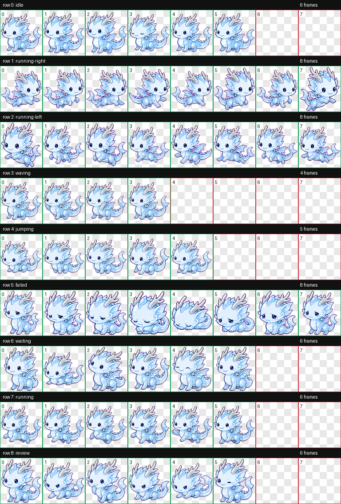
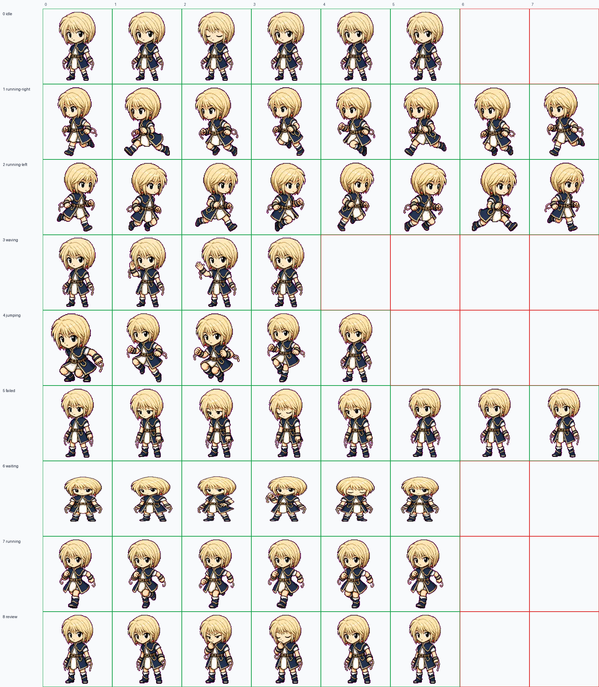
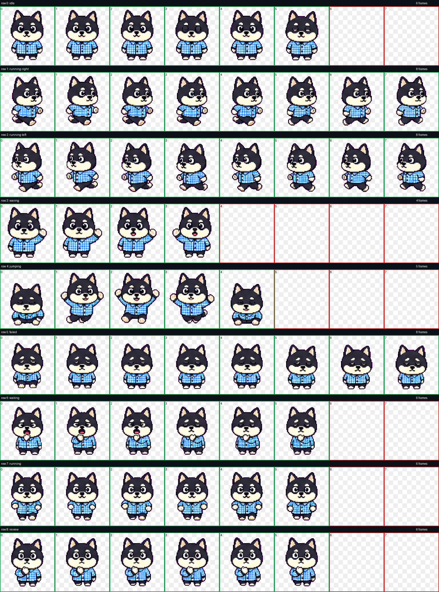
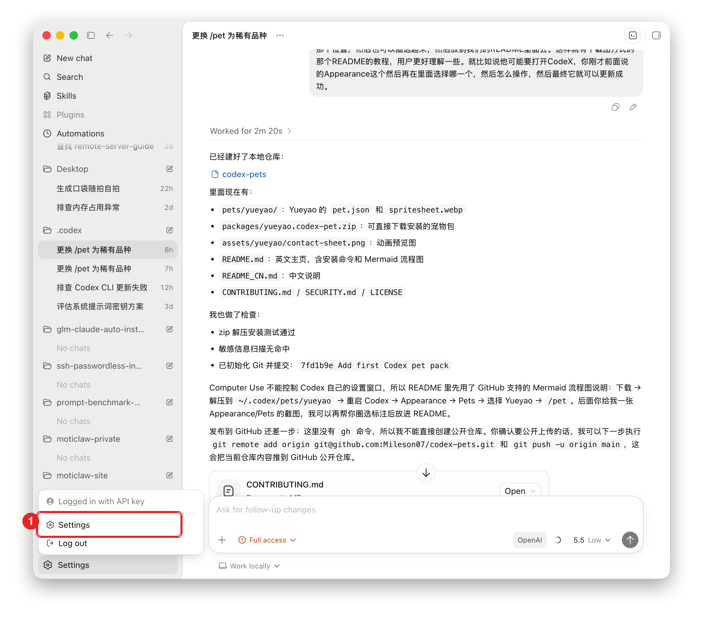
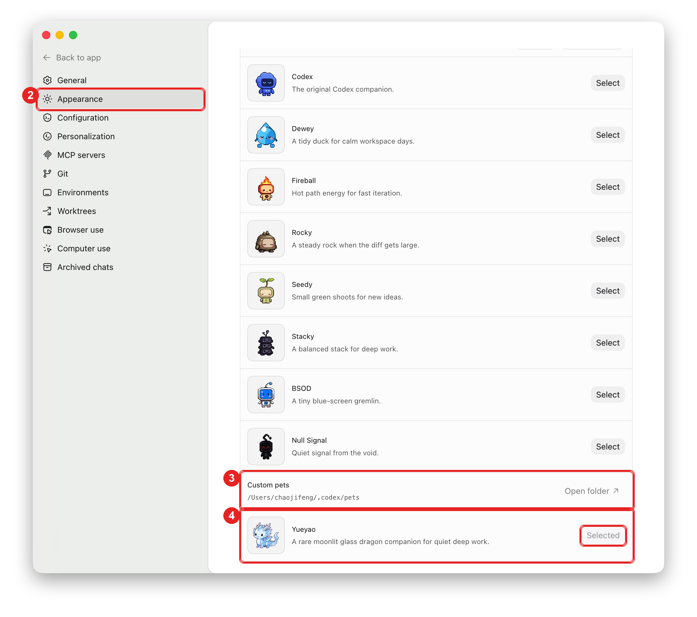

# Codex Pets

> A growing collection of custom pets for Codex Desktop.

[](LICENSE)
[](#pets)

[中文说明](README_CN.md)

## Pets

### Yueyao

Yueyao is a rare moonlit glass dragon companion for quiet deep work.



### Vowlet

Vowlet is a quiet blond chain guardian with a focused, watchful presence.



### Plaidpup

Plaidpup is a black shiba pup in a blue plaid shirt with regenerated coherent poses.



## Quick Install

Install Yueyao from this repository:

```bash
curl -L "https://github.com/mileson/codex-pets/releases/download/v0.1.0/yueyao.codex-pet.zip" -o "/tmp/yueyao.codex-pet.zip" \
  && mkdir -p "$HOME/.codex/pets/yueyao" \
  && unzip -o "/tmp/yueyao.codex-pet.zip" -d "$HOME/.codex/pets/yueyao"
```

Install Vowlet from the repository package:

```bash
curl -L "https://raw.githubusercontent.com/mileson/codex-pets/main/packages/vowlet.codex-pet.zip" -o "/tmp/vowlet.codex-pet.zip" \
  && mkdir -p "$HOME/.codex/pets/vowlet" \
  && unzip -o "/tmp/vowlet.codex-pet.zip" -d "$HOME/.codex/pets/vowlet"
```

Install Plaidpup from the repository package:

```bash
curl -L "https://raw.githubusercontent.com/mileson/codex-pets/main/packages/plaidpup.codex-pet.zip" -o "/tmp/plaidpup.codex-pet.zip" \
  && mkdir -p "$HOME/.codex/pets/plaidpup" \
  && unzip -o "/tmp/plaidpup.codex-pet.zip" -d "$HOME/.codex/pets/plaidpup"
```

If you cloned the repository locally, install from the checked-out files:

```bash
mkdir -p "$HOME/.codex/pets/yueyao" \
  && cp pets/yueyao/pet.json pets/yueyao/spritesheet.webp "$HOME/.codex/pets/yueyao/"
```

## Select The Pet

After installation:

1. Quit and reopen Codex Desktop.
2. Open Codex settings.
3. Go to **Appearance**.
4. Find **Pets**.
5. Select **Yueyao**.
6. Use `/pet` or **Wake Pet** to call it onto the screen.

Use the numbered callouts in the screenshots: first open **Settings** from the lower-left menu.



Then select **Appearance**, scroll to **Custom pets**, and choose **Yueyao**.




## Folder Layout

```text
codex-pets/
  assets/
    yueyao/
      contact-sheet.png
    vowlet/
      contact-sheet.png
    plaidpup/
      contact-sheet.png
  packages/
    yueyao.codex-pet.zip
    vowlet.codex-pet.zip
    plaidpup.codex-pet.zip
  pets/
    yueyao/
      pet.json
      spritesheet.webp
    vowlet/
      pet.json
      spritesheet.webp
    plaidpup/
      pet.json
      spritesheet.webp
```

Each pet folder should contain:

- `pet.json`: pet metadata.
- `spritesheet.webp`: the animation spritesheet.

The installable zip should contain those two files at the top level, not inside an extra nested folder.

## Add Another Pet

1. Create `pets/<pet-id>/`.
2. Add `pet.json` and `spritesheet.webp`.
3. Zip the two files into `packages/<pet-id>.codex-pet.zip`.
4. Add a preview image under `assets/<pet-id>/`.
5. Update this README and `README_CN.md`.

Example:

```bash
cd pets/yueyao
zip -r ../../packages/yueyao.codex-pet.zip pet.json spritesheet.webp
```

## Screenshots

Annotated screenshots live in [docs](docs/).

## Contributing

Pet packs, previews, and documentation improvements are welcome. Please read [CONTRIBUTING.md](CONTRIBUTING.md) before opening a pull request.

## Security

Please do not open a public issue for sensitive reports. See [SECURITY.md](SECURITY.md).

## License

MIT

## Author

- X: [Mileson07](https://x.com/Mileson07)
- Xiaohongshu: [超级峰](https://xhslink.com/m/4LnJ9aB1f97)
- Douyin: [超级峰](https://v.douyin.com/rH645q7trd8/)
