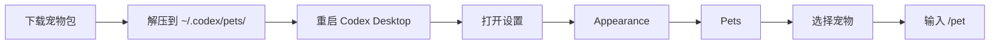

# Codex Pets

> Codex Desktop 自定义宠物合集。

[](LICENSE)
[](#宠物)

[English](README.md)

## 宠物


| 宠物 | 说明 | 安装包 |
| --- | --- | --- |
| Auruowl（极光学者猫头鹰） | 有明亮眉羽的极光学者猫头鹰，适合陪你专注审阅和检查。 | [auruowl.codex-pet.zip](packages/auruowl.codex-pet.zip) |
| Bonsaigo（盆景石像） | 头顶新芽的盆景石像伙伴，沉稳安静，适合陪你慢慢推进任务。 | [bonsaigo.codex-pet.zip](packages/bonsaigo.codex-pet.zip) |
| Canglan（苍岚麒麟） | 有玉角和云鬃的苍蓝小麒麟，温和灵动，适合安静陪伴。 | [canglan.codex-pet.zip](packages/canglan.codex-pet.zip) |
| Chadango（茶灯狸） | 带着团子尾饰的茶灯狸小伙伴，动作活泼，适合轻松陪伴。 | [chadango.codex-pet.zip](packages/chadango.codex-pet.zip) |
| Clockshiba（发条柴犬） | 戴着铜色齿轮项圈的发条柴犬，适合精神满满地陪你工作。 | [clockshiba.codex-pet.zip](packages/clockshiba.codex-pet.zip) |
| Cometpuff（彗尾绒鼠） | 拖着小彗尾的绒球仓鼠伙伴，轻快活泼，适合陪你推进任务。 | [cometpuff.codex-pet.zip](packages/cometpuff.codex-pet.zip) |
| Coralsea（珊瑚海马骑士） | 头顶小冠的珊瑚海马骑士，清爽灵动，适合安静陪伴。 | [coralsea.codex-pet.zip](packages/coralsea.codex-pet.zip) |
| CorgiByte（短腿柯基） | 开朗的短腿柯基代码伙伴，戴着小小青蓝火花挂坠。 | [corgibyte.codex-pet.zip](packages/corgibyte.codex-pet.zip) |
| Crystolotl（水晶美西螈） | 有棱晶鳃羽的水晶美西螈伙伴，晶莹轻快，适合陪伴工作。 | [crystolotl.codex-pet.zip](packages/crystolotl.codex-pet.zip) |
| Curarpikt（酷拉皮卡） | 安静专注的酷拉皮卡，适合陪你检查、思考和推进任务。 | [vowlet.codex-pet.zip](packages/vowlet.codex-pet.zip) |
| Dreamalpaca（梦云羊驼） | 披着星星毯的梦云羊驼，柔软安静，适合陪你进入专注状态。 | [dreamalpaca.codex-pet.zip](packages/dreamalpaca.codex-pet.zip) |
| Forgeling（炉火锻蜥） | 带着煤晶背甲的炉火锻蜥，温暖可靠，适合陪你处理复杂任务。 | [forgeling.codex-pet.zip](packages/forgeling.codex-pet.zip) |
| Glassbun（琉璃兔龙） | 长着小角耳的琉璃兔龙伙伴，晶莹轻快，适合安静陪伴。 | [glassbun.codex-pet.zip](packages/glassbun.codex-pet.zip) |
| Hearthslime（暖炉史莱姆） | 带着小煤芯的暖炉史莱姆，温和治愈，适合放松陪伴。 | [hearthslime.codex-pet.zip](packages/hearthslime.codex-pet.zip) |
| Honeybara（蜂蜜水豚） | 头顶小叶子的蜂蜜水豚，松弛温暖，适合陪你慢慢工作。 | [honeybara.codex-pet.zip](packages/honeybara.codex-pet.zip) |
| Inkyu（墨影九尾） | 刷尖尾巴的墨影九尾使魔，灵巧专注，适合陪你检查细节。 | [inkyu.codex-pet.zip](packages/inkyu.codex-pet.zip) |
| Jadeshell（玉壳龟贤者） | 背负符纹龟壳的玉壳龟贤者，沉稳安静，适合陪你深度思考。 | [jadeshell.codex-pet.zip](packages/jadeshell.codex-pet.zip) |
| Levimini（迷你利维坦） | 有鳍耳的迷你利维坦海龙，轻盈灵动，适合陪伴创作。 | [levimini.codex-pet.zip](packages/levimini.codex-pet.zip) |
| Lotuskoi（莲叶锦鲤） | 有莲叶鱼鳍的莲花锦鲤灵，宁静流动，适合安静陪伴。 | [lotuskoi.codex-pet.zip](packages/lotuskoi.codex-pet.zip) |
| Luminara（月灯蛾法师） | 有柔软翅膀的月灯蛾法师伙伴，适合安静陪你专注工作。 | [luminara.codex-pet.zip](packages/luminara.codex-pet.zip) |
| Mechabeet（机甲小甲虫） | 带着护目甲壳的机甲小甲虫，利落可靠，适合陪你处理任务。 | [mechabeet.codex-pet.zip](packages/mechabeet.codex-pet.zip) |
| Milkbyte（奶黄小龙） | 温暖的黄色奶龙小伙伴，奶油色肚皮和青蓝小火花点缀，适合轻松陪伴工作。 | [milkbyte.codex-pet.zip](packages/milkbyte.codex-pet.zip) |
| Mochimi（月团兔） | 带着弯月耳印的月团兔，软糯安静，适合温柔陪伴。 | [mochimi.codex-pet.zip](packages/mochimi.codex-pet.zip) |
| Nebujelly（星云水母） | 深蓝青色的星云水母伙伴，轻轻漂浮，适合陪你放松思考。 | [nebujelly.codex-pet.zip](packages/nebujelly.codex-pet.zip) |
| Neonwyrm（霓虹线龙） | 带青蓝线路鳍和明亮护目眼的霓虹小龙，适合陪你进入专注状态。 | [neonwyrm.codex-pet.zip](packages/neonwyrm.codex-pet.zip) |
| Noctcrow（夜鸦使魔） | 有月光喙尖的夜鸦使魔，冷静专注，适合陪你审阅和排查。 | [noctcrow.codex-pet.zip](packages/noctcrow.codex-pet.zip) |
| Pixpanda（像素熊猫） | 拿着竹笔的像素熊猫幼崽，亲切灵巧，适合陪你轻松工作。 | [pixpanda.codex-pet.zip](packages/pixpanda.codex-pet.zip) |
| Plaidpup（蓝格衬衫黑柴） | 穿蓝格衬衫的黑柴小伙伴，动作更连贯、适合轻松陪伴。 | [plaidpup.codex-pet.zip](packages/plaidpup.codex-pet.zip) |
| Runemole（符文鼹鼠） | 宝石鼻尖的符文鼹鼠矿工，踏实专注，适合陪你挖掘问题。 | [runemole.codex-pet.zip](packages/runemole.codex-pet.zip) |
| Silkmage（丝翼法师） | 披着折叠翼披风的丝翼法师，安静优雅，适合陪你整理思路。 | [silkmage.codex-pet.zip](packages/silkmage.codex-pet.zip) |
| Solara（太阳小凤凰） | 头顶微光羽冠的太阳小凤凰，适合明亮轻快地陪伴工作。 | [solara.codex-pet.zip](packages/solara.codex-pet.zip) |
| Starmanta（星纹蝠鲼） | 带着小彗尾的星纹蝠鲼，安静漂游，适合陪你保持节奏。 | [starmanta.codex-pet.zip](packages/starmanta.codex-pet.zip) |
| Vantacat（星眸黑猫） | 有星云眼睛的深黑猫使魔，神秘安静，适合陪你夜间专注。 | [vantacat.codex-pet.zip](packages/vantacat.codex-pet.zip) |
| Yueyao（月曜琉璃龙） | 稀有的月光琉璃龙，适合安静陪伴你深度工作。 | [yueyao.codex-pet.zip](packages/yueyao.codex-pet.zip) |
| Yukitsune（雪冠狐） | 耳尖带霜的小雪狐伙伴，适合轻盈安静地陪伴工作。 | [yukitsune.codex-pet.zip](packages/yukitsune.codex-pet.zip) |

每个宠物的完整动画预览可在对应的 `assets/<pet-id>/` 目录查看。

## 快速安装

从上方表格选择一个宠物 id，然后运行：

```bash
PET_ID="yueyao"
curl -L "https://raw.githubusercontent.com/mileson/codex-pets/main/packages/${PET_ID}.codex-pet.zip" -o "/tmp/${PET_ID}.codex-pet.zip" \
  && mkdir -p "$HOME/.codex/pets/${PET_ID}" \
  && unzip -o "/tmp/${PET_ID}.codex-pet.zip" -d "$HOME/.codex/pets/${PET_ID}"
```

如果你已经克隆了这个仓库，也可以从本地文件安装：

```bash
PET_ID="yueyao"
mkdir -p "$HOME/.codex/pets/${PET_ID}" \
  && cp "pets/${PET_ID}/pet.json" "pets/${PET_ID}/spritesheet.webp" "$HOME/.codex/pets/${PET_ID}/"
```

## 在 Codex 里选择宠物

安装后按这个流程操作：

1. 完整退出并重新打开 Codex Desktop。
2. 打开 Codex 设置。
3. 进入 **Appearance**。
4. 找到 **Pets**。
5. 选择你安装的宠物。
6. 输入 `/pet`，或者用 **Wake Pet** 呼唤它。

按截图里的编号操作：先从左下角菜单打开 **Settings**。


然后进入 **Appearance**，滚动到 **Custom pets**，选择你的宠物。




## 截图说明

带标注的截图放在 [docs](docs/) 目录。

## 贡献

欢迎提交新的宠物包、预览图和文档改进。提交前请先阅读 [CONTRIBUTING.md](CONTRIBUTING.md) 和 [docs/MAINTAINING.md](docs/MAINTAINING.md)。

## 安全

如果要报告敏感问题，请不要发公开 issue。请查看 [SECURITY.md](SECURITY.md)。

## 许可证

MIT

## 作者

- X: [Mileson07](https://x.com/Mileson07)
- 小红书: [超级峰](https://xhslink.com/m/4LnJ9aB1f97)
- 抖音: [超级峰](https://v.douyin.com/rH645q7trd8/)
