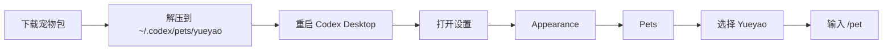

# Codex Pets

> Codex Desktop 自定义宠物合集。

[](LICENSE)
[](#宠物)

[English](README.md)

## 宠物

这张宫格由 `scripts/generate_pet_gallery.py` 根据 `pets/*/pet.json` 和每个 `spritesheet.webp` 的第一帧自动生成。新增宠物文件夹后重跑脚本，宫格会自动扩展成多行。


| 宠物 | 说明 | 安装包 |
| --- | --- | --- |
| Auruowl（极光学者猫头鹰） | 有明亮眉羽的极光学者猫头鹰，适合陪你专注审阅和检查。 | [auruowl.codex-pet.zip](packages/auruowl.codex-pet.zip) |
| Bonsaigo（盆景石像） | 头顶新芽的盆景石像伙伴，沉稳安静，适合陪你慢慢推进任务。 | [bonsaigo.codex-pet.zip](packages/bonsaigo.codex-pet.zip) |
| Canglan（苍岚麒麟） | 有玉角和云鬃的苍蓝小麒麟，温和灵动，适合安静陪伴。 | [canglan.codex-pet.zip](packages/canglan.codex-pet.zip) |
| Chadango（茶灯狸） | 带着团子尾饰的茶灯狸小伙伴，动作活泼，适合轻松陪伴。 | [chadango.codex-pet.zip](packages/chadango.codex-pet.zip) |
| Clockshiba（发条柴犬） | 戴着铜色齿轮项圈的发条柴犬，适合精神满满地陪你工作。 | [clockshiba.codex-pet.zip](packages/clockshiba.codex-pet.zip) |
| CorgiByte（短腿柯基） | 开朗的短腿柯基代码伙伴，戴着小小青蓝火花挂坠。 | [corgibyte.codex-pet.zip](packages/corgibyte.codex-pet.zip) |
| Glassbun（琉璃兔龙） | 长着小角耳的琉璃兔龙伙伴，晶莹轻快，适合安静陪伴。 | [glassbun.codex-pet.zip](packages/glassbun.codex-pet.zip) |
| Milkbyte（奶黄小龙） | 温暖的黄色奶龙小伙伴，奶油色肚皮和青蓝小火花点缀，适合轻松陪伴工作。 | [milkbyte.codex-pet.zip](packages/milkbyte.codex-pet.zip) |
| Plaidpup（蓝格衬衫黑柴） | 穿蓝格衬衫的黑柴小伙伴，动作更连贯、适合轻松陪伴。 | [plaidpup.codex-pet.zip](packages/plaidpup.codex-pet.zip) |
| Solara（太阳小凤凰） | 头顶微光羽冠的太阳小凤凰，适合明亮轻快地陪伴工作。 | [solara.codex-pet.zip](packages/solara.codex-pet.zip) |
| Vowlet（金发链环守护者） | 安静专注的金发链环守护者，适合陪你检查、思考和推进任务。 | [vowlet.codex-pet.zip](packages/vowlet.codex-pet.zip) |
| Yueyao（月曜琉璃龙） | 稀有的月光琉璃龙，适合安静陪伴你深度工作。 | [yueyao.codex-pet.zip](packages/yueyao.codex-pet.zip) |

完整动画预览仍保留在 `assets/<pet-id>/` 目录下。

## 快速安装

从仓库包下载并安装 Auruowl：

```bash
curl -L "https://raw.githubusercontent.com/mileson/codex-pets/main/packages/auruowl.codex-pet.zip" -o "/tmp/auruowl.codex-pet.zip" \
  && mkdir -p "$HOME/.codex/pets/auruowl" \
  && unzip -o "/tmp/auruowl.codex-pet.zip" -d "$HOME/.codex/pets/auruowl"
```

从仓库包下载并安装 Bonsaigo：

```bash
curl -L "https://raw.githubusercontent.com/mileson/codex-pets/main/packages/bonsaigo.codex-pet.zip" -o "/tmp/bonsaigo.codex-pet.zip" \
  && mkdir -p "$HOME/.codex/pets/bonsaigo" \
  && unzip -o "/tmp/bonsaigo.codex-pet.zip" -d "$HOME/.codex/pets/bonsaigo"
```

从仓库包下载并安装 Canglan：

```bash
curl -L "https://raw.githubusercontent.com/mileson/codex-pets/main/packages/canglan.codex-pet.zip" -o "/tmp/canglan.codex-pet.zip" \
  && mkdir -p "$HOME/.codex/pets/canglan" \
  && unzip -o "/tmp/canglan.codex-pet.zip" -d "$HOME/.codex/pets/canglan"
```

从仓库包下载并安装 Chadango：

```bash
curl -L "https://raw.githubusercontent.com/mileson/codex-pets/main/packages/chadango.codex-pet.zip" -o "/tmp/chadango.codex-pet.zip" \
  && mkdir -p "$HOME/.codex/pets/chadango" \
  && unzip -o "/tmp/chadango.codex-pet.zip" -d "$HOME/.codex/pets/chadango"
```

从仓库包下载并安装 Clockshiba：

```bash
curl -L "https://raw.githubusercontent.com/mileson/codex-pets/main/packages/clockshiba.codex-pet.zip" -o "/tmp/clockshiba.codex-pet.zip" \
  && mkdir -p "$HOME/.codex/pets/clockshiba" \
  && unzip -o "/tmp/clockshiba.codex-pet.zip" -d "$HOME/.codex/pets/clockshiba"
```

从仓库包下载并安装 CorgiByte：

```bash
curl -L "https://raw.githubusercontent.com/mileson/codex-pets/main/packages/corgibyte.codex-pet.zip" -o "/tmp/corgibyte.codex-pet.zip" \
  && mkdir -p "$HOME/.codex/pets/corgibyte" \
  && unzip -o "/tmp/corgibyte.codex-pet.zip" -d "$HOME/.codex/pets/corgibyte"
```

从仓库包下载并安装 Glassbun：

```bash
curl -L "https://raw.githubusercontent.com/mileson/codex-pets/main/packages/glassbun.codex-pet.zip" -o "/tmp/glassbun.codex-pet.zip" \
  && mkdir -p "$HOME/.codex/pets/glassbun" \
  && unzip -o "/tmp/glassbun.codex-pet.zip" -d "$HOME/.codex/pets/glassbun"
```

从仓库包下载并安装 Milkbyte：

```bash
curl -L "https://raw.githubusercontent.com/mileson/codex-pets/main/packages/milkbyte.codex-pet.zip" -o "/tmp/milkbyte.codex-pet.zip" \
  && mkdir -p "$HOME/.codex/pets/milkbyte" \
  && unzip -o "/tmp/milkbyte.codex-pet.zip" -d "$HOME/.codex/pets/milkbyte"
```

从仓库包下载并安装 Solara：

```bash
curl -L "https://raw.githubusercontent.com/mileson/codex-pets/main/packages/solara.codex-pet.zip" -o "/tmp/solara.codex-pet.zip" \
  && mkdir -p "$HOME/.codex/pets/solara" \
  && unzip -o "/tmp/solara.codex-pet.zip" -d "$HOME/.codex/pets/solara"
```

从 GitHub 下载并安装 Yueyao：

```bash
curl -L "https://github.com/mileson/codex-pets/releases/download/v0.1.0/yueyao.codex-pet.zip" -o "/tmp/yueyao.codex-pet.zip" \
  && mkdir -p "$HOME/.codex/pets/yueyao" \
  && unzip -o "/tmp/yueyao.codex-pet.zip" -d "$HOME/.codex/pets/yueyao"
```

从仓库包下载并安装 Vowlet：

```bash
curl -L "https://raw.githubusercontent.com/mileson/codex-pets/main/packages/vowlet.codex-pet.zip" -o "/tmp/vowlet.codex-pet.zip" \
  && mkdir -p "$HOME/.codex/pets/vowlet" \
  && unzip -o "/tmp/vowlet.codex-pet.zip" -d "$HOME/.codex/pets/vowlet"
```

从仓库包下载并安装 Plaidpup：

```bash
curl -L "https://raw.githubusercontent.com/mileson/codex-pets/main/packages/plaidpup.codex-pet.zip" -o "/tmp/plaidpup.codex-pet.zip" \
  && mkdir -p "$HOME/.codex/pets/plaidpup" \
  && unzip -o "/tmp/plaidpup.codex-pet.zip" -d "$HOME/.codex/pets/plaidpup"
```

如果你已经克隆了这个仓库，也可以从本地文件安装：

```bash
mkdir -p "$HOME/.codex/pets/yueyao" \
  && cp pets/yueyao/pet.json pets/yueyao/spritesheet.webp "$HOME/.codex/pets/yueyao/"
```

## 在 Codex 里选择宠物

安装后按这个流程操作：

1. 完整退出并重新打开 Codex Desktop。
2. 打开 Codex 设置。
3. 进入 **Appearance**。
4. 找到 **Pets**。
5. 选择 **Yueyao**。
6. 输入 `/pet`，或者用 **Wake Pet** 呼唤它。

按截图里的编号操作：先从左下角菜单打开 **Settings**。


然后进入 **Appearance**，滚动到 **Custom pets**，选择 **Yueyao**。




## 仓库结构

```text
codex-pets/
  assets/
    pet-gallery.png
    auruowl/
      contact-sheet.png
    bonsaigo/
      contact-sheet.png
    canglan/
      contact-sheet.png
    chadango/
      contact-sheet.png
    clockshiba/
      contact-sheet.png
    corgibyte/
      contact-sheet.png
    glassbun/
      contact-sheet.png
    milkbyte/
      contact-sheet.png
    solara/
      contact-sheet.png
    yueyao/
      contact-sheet.png
    vowlet/
      contact-sheet.png
    plaidpup/
      contact-sheet.png
  scripts/
    generate_pet_gallery.py
  requirements.txt
  packages/
    auruowl.codex-pet.zip
    bonsaigo.codex-pet.zip
    canglan.codex-pet.zip
    chadango.codex-pet.zip
    clockshiba.codex-pet.zip
    corgibyte.codex-pet.zip
    glassbun.codex-pet.zip
    milkbyte.codex-pet.zip
    solara.codex-pet.zip
    yueyao.codex-pet.zip
    vowlet.codex-pet.zip
    plaidpup.codex-pet.zip
  pets/
    auruowl/
      pet.json
      spritesheet.webp
    bonsaigo/
      pet.json
      spritesheet.webp
    canglan/
      pet.json
      spritesheet.webp
    chadango/
      pet.json
      spritesheet.webp
    clockshiba/
      pet.json
      spritesheet.webp
    corgibyte/
      pet.json
      spritesheet.webp
    glassbun/
      pet.json
      spritesheet.webp
    milkbyte/
      pet.json
      spritesheet.webp
    solara/
      pet.json
      spritesheet.webp
    yueyao/
      pet.json
      spritesheet.webp
    vowlet/
      pet.json
      spritesheet.webp
    plaidpup/
      pet.json
      spritesheet.webp
```

每个宠物文件夹需要包含：

- `pet.json`：宠物信息。
- `spritesheet.webp`：动画精灵图。

可安装的 zip 包里应该直接包含这两个文件，不要再套一层文件夹。

## 添加新的宠物

1. 创建 `pets/<pet-id>/`。
2. 放入 `pet.json` 和 `spritesheet.webp`。
3. 打包成 `packages/<pet-id>.codex-pet.zip`。
4. 如有需要，在 `assets/<pet-id>/` 放一张完整预览图。
5. 如有需要，先运行 `python3 -m pip install -r requirements.txt` 安装工具依赖。
6. 运行 `python3 scripts/generate_pet_gallery.py` 刷新宫格图。
7. 如果简短说明有变化，更新 `README.md` 和 `README_CN.md`。

完整的维护流程和 Agent 操作规范见 [docs/MAINTAINING.md](docs/MAINTAINING.md)。

示例：

```bash
cd pets/yueyao
zip -r ../../packages/yueyao.codex-pet.zip pet.json spritesheet.webp
```

## 截图说明

带标注的截图放在 [docs](docs/) 目录。

## 贡献

欢迎提交新的宠物包、预览图和文档改进。提交前请先阅读 [CONTRIBUTING.md](CONTRIBUTING.md) 和 [docs/MAINTAINING.md](docs/MAINTAINING.md)。

## 安全

如果要报告敏感问题，请不要发公开 issue。请查看 [SECURITY.md](SECURITY.md)。

## 许可证

MIT

## 作者

- X: [Mileson07](https://x.com/Mileson07)
- 小红书: [超级峰](https://xhslink.com/m/4LnJ9aB1f97)
- 抖音: [超级峰](https://v.douyin.com/rH645q7trd8/)
