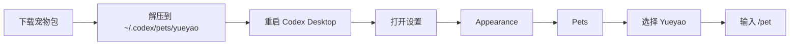

# Codex Pets

> Codex Desktop 自定义宠物合集。

[](LICENSE)
[](#宠物)

[English](README.md)

## 宠物

### Yueyao（月曜琉璃龙）

Yueyao 是一只稀有的月光琉璃龙，适合安静陪伴你深度工作。


### Vowlet（金发链环守护者）

Vowlet 是一位安静专注的金发链环守护者，适合陪你检查、思考和推进任务。


### Plaidpup（蓝格衬衫黑柴）

Plaidpup 是一只穿蓝格衬衫的黑柴小伙伴，动作来自重新生成的完整姿态。


## 快速安装

从 GitHub 下载并安装 Yueyao：

```bash
curl -L "https://github.com/mileson/codex-pets/releases/download/v0.1.0/yueyao.codex-pet.zip" -o "/tmp/yueyao.codex-pet.zip" \
  && mkdir -p "$HOME/.codex/pets/yueyao" \
  && unzip -o "/tmp/yueyao.codex-pet.zip" -d "$HOME/.codex/pets/yueyao"
```

从仓库包下载并安装 Vowlet：

```bash
curl -L "https://raw.githubusercontent.com/mileson/codex-pets/main/packages/vowlet.codex-pet.zip" -o "/tmp/vowlet.codex-pet.zip" \
  && mkdir -p "$HOME/.codex/pets/vowlet" \
  && unzip -o "/tmp/vowlet.codex-pet.zip" -d "$HOME/.codex/pets/vowlet"
```

从仓库包下载并安装 Plaidpup：

```bash
curl -L "https://raw.githubusercontent.com/mileson/codex-pets/main/packages/plaidpup.codex-pet.zip" -o "/tmp/plaidpup.codex-pet.zip" \
  && mkdir -p "$HOME/.codex/pets/plaidpup" \
  && unzip -o "/tmp/plaidpup.codex-pet.zip" -d "$HOME/.codex/pets/plaidpup"
```

如果你已经克隆了这个仓库，也可以从本地文件安装：

```bash
mkdir -p "$HOME/.codex/pets/yueyao" \
  && cp pets/yueyao/pet.json pets/yueyao/spritesheet.webp "$HOME/.codex/pets/yueyao/"
```

## 在 Codex 里选择宠物

安装后按这个流程操作：

1. 完整退出并重新打开 Codex Desktop。
2. 打开 Codex 设置。
3. 进入 **Appearance**。
4. 找到 **Pets**。
5. 选择 **Yueyao**。
6. 输入 `/pet`，或者用 **Wake Pet** 呼唤它。

按截图里的编号操作：先从左下角菜单打开 **Settings**。


然后进入 **Appearance**，滚动到 **Custom pets**，选择 **Yueyao**。




## 仓库结构

```text
codex-pets/
  assets/
    yueyao/
      contact-sheet.png
    vowlet/
      contact-sheet.png
    plaidpup/
      contact-sheet.png
  packages/
    yueyao.codex-pet.zip
    vowlet.codex-pet.zip
    plaidpup.codex-pet.zip
  pets/
    yueyao/
      pet.json
      spritesheet.webp
    vowlet/
      pet.json
      spritesheet.webp
    plaidpup/
      pet.json
      spritesheet.webp
```

每个宠物文件夹需要包含：

- `pet.json`：宠物信息。
- `spritesheet.webp`：动画精灵图。

可安装的 zip 包里应该直接包含这两个文件，不要再套一层文件夹。

## 添加新的宠物

1. 创建 `pets/<pet-id>/`。
2. 放入 `pet.json` 和 `spritesheet.webp`。
3. 打包成 `packages/<pet-id>.codex-pet.zip`。
4. 在 `assets/<pet-id>/` 放一张预览图。
5. 更新 `README.md` 和 `README_CN.md`。

示例：

```bash
cd pets/yueyao
zip -r ../../packages/yueyao.codex-pet.zip pet.json spritesheet.webp
```

## 截图说明

带标注的截图放在 [docs](docs/) 目录。

## 贡献

欢迎提交新的宠物包、预览图和文档改进。提交前请先阅读 [CONTRIBUTING.md](CONTRIBUTING.md)。

## 安全

如果要报告敏感问题，请不要发公开 issue。请查看 [SECURITY.md](SECURITY.md)。

## 许可证

MIT

## 作者

- X: [Mileson07](https://x.com/Mileson07)
- 小红书: [超级峰](https://xhslink.com/m/4LnJ9aB1f97)
- 抖音: [超级峰](https://v.douyin.com/rH645q7trd8/)
