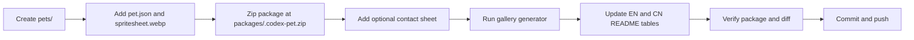

# Maintainer Guide

This guide is for humans and future agents that add or refresh Codex pets in this repository.

## Repository Shape

Each published pet has the same four surfaces:

| Surface | Path | Purpose |
| --- | --- | --- |
| Source files | `pets/<pet-id>/pet.json`, `pets/<pet-id>/spritesheet.webp` | Canonical pet files |
| Install package | `packages/<pet-id>.codex-pet.zip` | Downloadable Codex pet pack |
| Detailed preview | `assets/<pet-id>/contact-sheet.png` | Full animation contact sheet |
| Gallery tile | `assets/pet-gallery.png` | Auto-generated README mosaic |
| Tooling | `requirements.txt`, `scripts/generate_pet_gallery.py` | Gallery generation dependency and script |

The README gallery is intentionally one compact mosaic. Do not paste every full contact sheet into the main README.

## Add A New Pet

Use this flow for a new pet such as **Context Pad**.



1. Pick a stable id.

   Use lowercase words separated by hyphens. For **Context Pad**, use `context-pad` unless the user asks for another id.

2. Create the pet folder.

   ```bash
   mkdir -p pets/context-pad assets/context-pad
   ```

3. Add `pet.json`.

   ```json
   {
     "id": "context-pad",
     "displayName": "Context Pad",
     "description": "A compact context notebook companion for keeping ideas close.",
     "spritesheetPath": "spritesheet.webp"
   }
   ```

   Keep `description` short, English, and user-facing. Do not include generation prompts or internal process notes.

4. Add `spritesheet.webp`.

   The file must be a Codex pet spritesheet compatible with the existing pets. Keep the filename exactly `spritesheet.webp`.

5. Build the install package.

   ```bash
   cd pets/context-pad
   zip -r ../../packages/context-pad.codex-pet.zip pet.json spritesheet.webp
   cd ../..
   ```

   Confirm the zip root is correct:

   ```bash
   unzip -l packages/context-pad.codex-pet.zip
   ```

   Expected shape:

   ```text
   pet.json
   spritesheet.webp
   ```

6. Add a detailed preview if available.

   Save it as:

   ```text
   assets/context-pad/contact-sheet.png
   ```

7. Refresh the mosaic gallery.

   Install tooling once if this Python environment does not already have Pillow:

   ```bash
   python3 -m pip install -r requirements.txt
   ```

   ```bash
   python3 scripts/generate_pet_gallery.py
   ```

   The script scans `pets/*/pet.json`, crops the first frame from each `spritesheet.webp`, sorts pets by display name, and writes `assets/pet-gallery.png`. With three pets it renders one row of three tiles; with more pets it expands into additional rows.

8. Update README tables.

   Add one compact row to both files:

   - `README.md`
   - `README_CN.md`

   Also update the pet-count badge if the number of folders under `pets/` changed.

9. Verify before committing.

   ```bash
   python3 -m pip install -r requirements.txt
   python3 scripts/generate_pet_gallery.py
   unzip -t packages/context-pad.codex-pet.zip
   unzip -p packages/context-pad.codex-pet.zip pet.json
   git diff --check
   git status --short --untracked-files=all
   ```

   Stage only the new pet files, refreshed package, refreshed gallery, and README changes. Leave unrelated local drafts untouched.

## Update An Existing Pet

When refreshing an existing pet's art or metadata:

1. Keep the existing `id`, folder name, package name, and README link stable unless the user explicitly asks for a rename.
2. Replace `pets/<pet-id>/spritesheet.webp` or update `pet.json`.
3. Rebuild `packages/<pet-id>.codex-pet.zip`.
4. Refresh `assets/<pet-id>/contact-sheet.png` if the animation changed.
5. Install tooling if needed, then run `python3 scripts/generate_pet_gallery.py`.
6. Update README descriptions only if the visible pet concept changed.
7. Run the verification commands above.

## Local Install Test

To test a package in Codex Desktop:

```bash
mkdir -p "$HOME/.codex/pets/context-pad"
unzip -o "packages/context-pad.codex-pet.zip" -d "$HOME/.codex/pets/context-pad"
```

Then restart Codex Desktop, open **Settings / Appearance / Pets**, select the pet, and run `/pet`.
