# Maintainer Guide

This guide is for humans and future agents that add or refresh Codex pets in this repository.

## Repository Shape

Each published pet has the same four surfaces:

| Surface | Path | Purpose |
| --- | --- | --- |
| Source files | `pets/<pet-id>/pet.json`, `pets/<pet-id>/spritesheet.webp` | Canonical pet files |
| Install package | `packages/<pet-id>.codex-pet.zip` | Downloadable Codex pet pack |
| Detailed preview | `assets/<pet-id>/contact-sheet.png` | Full animation contact sheet |
| English gallery | `assets/pet-gallery.png` | README mosaic with English pet names |
| Chinese gallery | `assets/pet-gallery-cn.png` | README_CN mosaic with Chinese pet names |
| Chinese gallery names | `docs/pet-gallery.zh.json` | Localized labels used only for the Chinese mosaic |
| Tooling | `requirements.txt`, `scripts/generate_pet_gallery.py` | Gallery generation dependency and script |

The README galleries are intentionally compact mosaics. Do not paste every full contact sheet into the main README files.

The English and Chinese galleries are separate images:

- `README.md` uses `assets/pet-gallery.png`.
- `README_CN.md` uses `assets/pet-gallery-cn.png`.
- Every pet added to `pets/` must also get a Chinese label in `docs/pet-gallery.zh.json`.
- The Chinese gallery must show Chinese pet names only. Do not reuse the English gallery in `README_CN.md`.

## Add A New Pet

Use this flow for a new pet such as **Context Pad**.

```mermaid
flowchart LR
  A["Create pets/<pet-id>"] --> B["Add pet.json and spritesheet.webp"]
  B --> C["Zip package at packages/<pet-id>.codex-pet.zip"]
  C --> D["Add optional contact sheet"]
  D --> E["Update localized gallery names"]
  E --> F["Run gallery generator"]
  F --> G["Update EN and CN README tables"]
  G --> H["Verify package and diff"]
  H --> I["Commit and push"]
```



1. Pick a stable id.

   Use lowercase words separated by hyphens. For **Context Pad**, use `context-pad` unless the user asks for another id.

2. Create the pet folder.

   ```bash
   mkdir -p pets/context-pad assets/context-pad
   ```

3. Add `pet.json`.

   ```json
   {
     "id": "context-pad",
     "displayName": "Context Pad",
     "description": "A compact context notebook companion for keeping ideas close.",
     "spritesheetPath": "spritesheet.webp"
   }
   ```

   Keep `description` short, English, and user-facing. Do not include generation prompts or internal process notes.

4. Add `spritesheet.webp`.

   The file must be a Codex pet spritesheet compatible with the existing pets. Keep the filename exactly `spritesheet.webp`.

5. Build the install package.

   ```bash
   cd pets/context-pad
   zip -r ../../packages/context-pad.codex-pet.zip pet.json spritesheet.webp
   cd ../..
   ```

   Confirm the zip root is correct:

   ```bash
   unzip -l packages/context-pad.codex-pet.zip
   ```

   Expected shape:

   ```text
   pet.json
   spritesheet.webp
   ```

6. Add a detailed preview if available.

   Save it as:

   ```text
   assets/context-pad/contact-sheet.png
   ```

7. Add the Chinese gallery name.

   Update `docs/pet-gallery.zh.json` with a concise Chinese display label:

   ```json
   {
     "context-pad": "上下文便签"
   }
   ```

   This label is only for the Chinese README gallery. Keep `pet.json` in English for Codex package metadata.

8. Refresh both mosaic galleries.

   Install tooling once if this Python environment does not already have Pillow:

   ```bash
   python3 -m pip install -r requirements.txt
   ```

   ```bash
   python3 scripts/generate_pet_gallery.py
   python3 scripts/generate_pet_gallery.py --locale zh
   ```

   The script scans `pets/*/pet.json`, crops the first frame from each `spritesheet.webp`, sorts pets by English display name, and writes localized gallery images. It renders at most seven pets per row.

9. Update README tables.

   Add one compact row to both files:

   - `README.md`
   - `README_CN.md`

   Also update the pet-count badge and gallery cache parameter if the number of folders under `pets/` changed.

   Keep public README copy user-facing. Avoid putting generation steps, repository layout, zip-shape details, or agent workflow notes in `README.md` or `README_CN.md`; those belong in this maintainer guide.

10. Verify before committing.

   ```bash
   python3 -m pip install -r requirements.txt
   python3 scripts/generate_pet_gallery.py
   python3 scripts/generate_pet_gallery.py --locale zh
   unzip -t packages/context-pad.codex-pet.zip
   unzip -p packages/context-pad.codex-pet.zip pet.json
   git diff --check
   git status --short --untracked-files=all
   ```

   Stage only the new pet files, refreshed package, contact sheet, both refreshed galleries, localized name mapping, and README changes. Leave unrelated local drafts untouched.

## Update An Existing Pet

When refreshing an existing pet's art or metadata:

1. Keep the existing `id`, folder name, package name, and README link stable unless the user explicitly asks for a rename.
2. Replace `pets/<pet-id>/spritesheet.webp` or update `pet.json`.
3. Rebuild `packages/<pet-id>.codex-pet.zip`.
4. Refresh `assets/<pet-id>/contact-sheet.png` if the animation changed.
5. Install tooling if needed, then refresh both galleries:

   ```bash
   python3 scripts/generate_pet_gallery.py
   python3 scripts/generate_pet_gallery.py --locale zh
   ```

6. Update `docs/pet-gallery.zh.json` only if the Chinese display label should change.
7. Update README descriptions only if the visible pet concept changed.
8. Run the verification commands above.

## Local Install Test

To test a package in Codex Desktop:

```bash
mkdir -p "$HOME/.codex/pets/context-pad"
unzip -o "packages/context-pad.codex-pet.zip" -d "$HOME/.codex/pets/context-pad"
```

Then restart Codex Desktop, open **Settings / Appearance / Pets**, select the pet, and run `/pet`.
